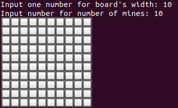
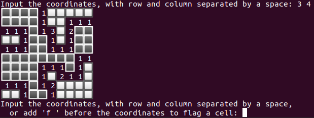
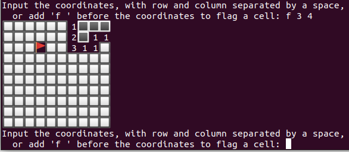

# 💥 Minesweeper

## Installation
```
git clone https://github.com/NoZ915/minesweeper.git
cd minesweeper
node index.js
```

## Usage
* Input numbers for board's width and number of mines  
    

* Input the coordinates, with row and column separated by a space, to reveal the cell
* Add 'f ' before the coordinates if you want to flag a cell
  | Key | Example | Image |
  | :--: | :-----: | :----: |
  |row col | 3 4 to reveal the cell at position(3, 4) |  |
  |f row col | f 3 4 to place the flag at position(3, 4) |  |
